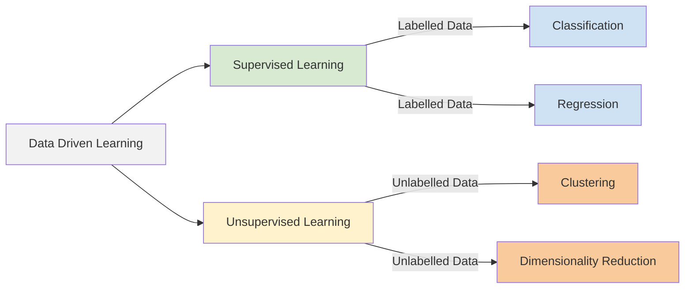
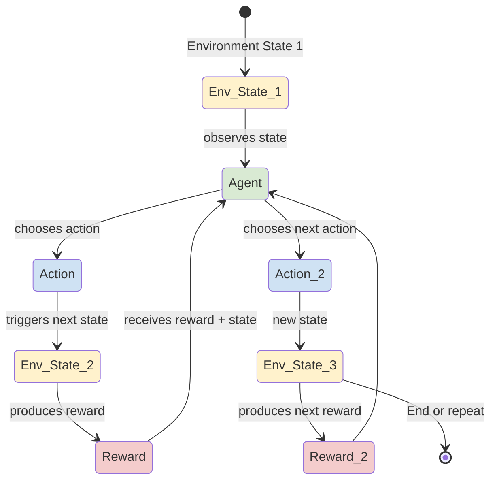

Artificial Intelligence (AI) has made significant strides in recent years, and one of the most exciting areas of AI is Reinforcement Learning (RL). Let's understand what RL is, how it works, why it's important and how it differs from the traditional machine learning paradigms.

## Modern Machine Learning Paradigms

Artificial intelligence (AI) is a broad field that encompasses various techniques and approaches to enable machines to make decisions. While this can be as simple as a rule-based system, modern AI often relies on data-driven approaches to learn from examples.

The paradigm of Data driven Machine learning (ML) can generally be divided into two main categories:

- **Supervised Learning**: In this approach, the model is trained on a labelled dataset, where the input data is paired with the correct output. The model learns to map inputs to outputs based on this training data. Classical examples include image classification, where the model learns to identify objects in images based on labelled examples, and regression tasks, where the model predicts continuous values based on input features.

- **Unsupervised Learning**: Here, the model is trained on an unlabelled dataset, where it tries to find patterns or structures in the data without explicit labels. Clustering and dimensionality reduction are common tasks in unsupervised learning.

 

<em>Figure 1: Data driven machine learning</em>
 

 

But what about scenarios where an agent needs to learn how to make decisions based on interactions with an environment? This is where Reinforcement Learning comes into play.

----------------

## What Is Reinforcement Learning?

Let's take the example of how a human child adapts and learns. 
Across multiple stages of our lives, we learn from different sources and from multiple modes of data.
Being in a classroom, we learn from teachers and textbooks from a set of "labeled" data (supervised learning).
When we play with toys, we explore and discover new things on our own (unsupervised learning).
When we play games, we learn from our mistakes and successes, adjusting our strategies based on feedback (reinforcement learning).

> *Reinforcement learning bridges the gap between supervised and unsupervised learning by allowing an agent to learn from   its own actions and experiences in an environment. It is a type of machine learning where an agent learns to make decisions by taking actions in an environment and by dealing with consequences.*
>

 

## How Does Reinforcement Learning Work?

Let's break down the key components of reinforcement learning:

- **Agent**: The learner or decision-maker that interacts with the environment. It can be a robot, a software program, or any entity that needs to learn from its actions.

- **Environment**: The external system with which the agent interacts. It can be a physical world, a game, or any scenario where the agent needs to make decisions.

- **Actions**: The set of all possible moves or decisions the agent can make in the environment. The agent chooses actions based on its current state.

- **States**: The current situation or configuration of the environment. The agent observes the state before taking an action.

- **Rewards**: A numerical feedback signal received by the agent after taking an action in a particular state. The goal of the agent is to maximize the cumulative reward over time.

- **Policy**: A strategy or mapping from states to actions that the agent follows to make decisions. The policy can be deterministic (always choosing the same action for a given state) or stochastic (choosing actions probabilistically).

<em>Figure 2: Agent-Environment Interaction Loop</em>
 

The agent interacts with the environment in a loop, observing the current state, taking an action, receiving a reward, and transitioning to a new state. The agent's goal is to learn a policy that maximizes the cumulative reward over time.

## How Is Reinforcement Learning Different From Other Machine Learning Paradigms?

Reinforcement learning differs from traditional machine learning paradigms in several keyways:

- **Learning from Interaction**: In reinforcement learning, the agent learns by interacting with the environment and receiving feedback in the form of rewards. This is different from supervised learning, where the model learns from labelled data, and unsupervised learning, where the model learns from unlabelled data
and then the trained model is used to infer on new data.

- **Exploration vs. Exploitation**: Reinforcement learning involves a trade-off between exploration (trying new actions to discover their effects) and exploitation (choosing the best-known actions based on past experiences). This is not a concern in supervised or unsupervised learning, where the model is trained on fixed data.

- **Delayed Rewards**: In reinforcement learning, the agent may receive rewards after taking a sequence of actions, making it necessary to consider the long-term consequences of actions. In contrast, supervised learning typically provides immediate feedback for each training example.

- **Sequential Decision Making**: Reinforcement learning deals with sequential decision-making problems, where the agent's actions affect future states and rewards. This is different from supervised learning, which often treats each example independently.

- **Dynamic Environments**: Reinforcement learning is well-suited for dynamic environments where the agent needs to adapt to changing conditions. In contrast, supervised and unsupervised learning often assume a static dataset.

## Formal Definition

In a more formal and mathematical sense, reinforcement learning can be defined as follows:

> Reinforcement learning is ***discrete time stochastic control task***

If that is a mouthful, let's break it down:

- **Discrete Time**: The learning process occurs in discrete time steps, where the agent observes the current state, takes an action, and receives a reward at each time step.
- **Stochastic**: The environment is stochastic, meaning that the outcomes of actions are independent of the agent's actions and are predicted by a probability distribution. This means that the same action taken in the same state may lead to different outcomes.
- **Control Task**: The agent's goal is to control the environment by selecting actions that maximize the cumulative reward over time. This involves sequential decision-making, where the agent's actions affect future states and rewards.

## Applications Of Reinforcement Learning

Reinforcement learning has found applications in various domains, specially where sequential decision-making is crucial.
In the absence of sufficient data, RL can be used to learn optimal policies through trial and error. Some notable applications include:

- **Robotics**: Robots learn to perform tasks like grasping objects, walking, and navigating environments through trial and error.
- **Game Playing**: Agents have achieved superhuman performance in games like Go, Chess, and Dota 2 by learning optimal strategies through self-play.
- **Autonomous Vehicles**: RL is used to train self-driving cars to make decisions in complex traffic scenarios.
- **Recommendation Systems**: Can be optimize recommendations by learning user preferences and adapting to changing behaviours.
- **Healthcare**: Applied in personalized treatment plans, drug discovery, and optimizing healthcare operations.
- **Finance**: RL is used for portfolio management, algorithmic trading, and risk assessment.
- **Industrial Automation**: RL is applied in optimizing manufacturing processes, supply chain management, and resource allocation.

## Conclusion

This article covered the bare essentials of reinforcement learning, enough to get started and understand its significance in the field of AI.
Reinforcement learning is a powerful paradigm that enables agents to learn from their interactions with the environment, making it suitable for complex decision-making tasks. Its ability to learn from trial and error, adapt to dynamic environments, and optimize long-term rewards has led to its success in various applications, from robotics to game playing and beyond.

